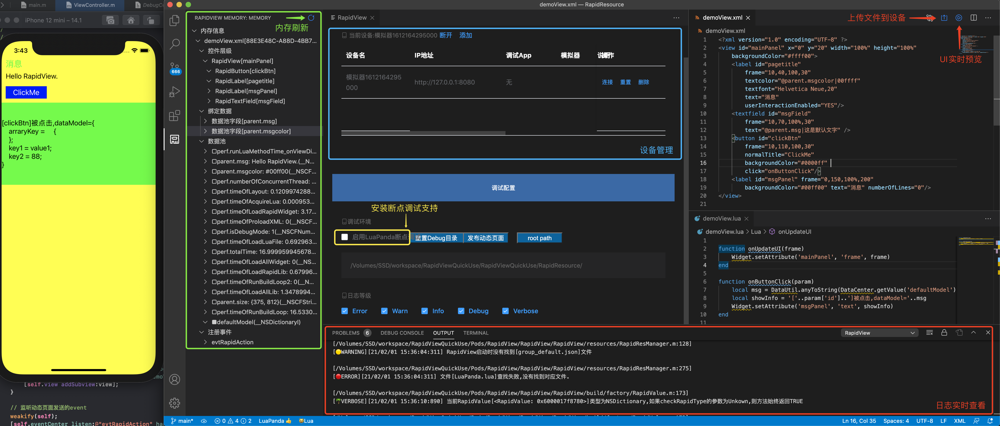
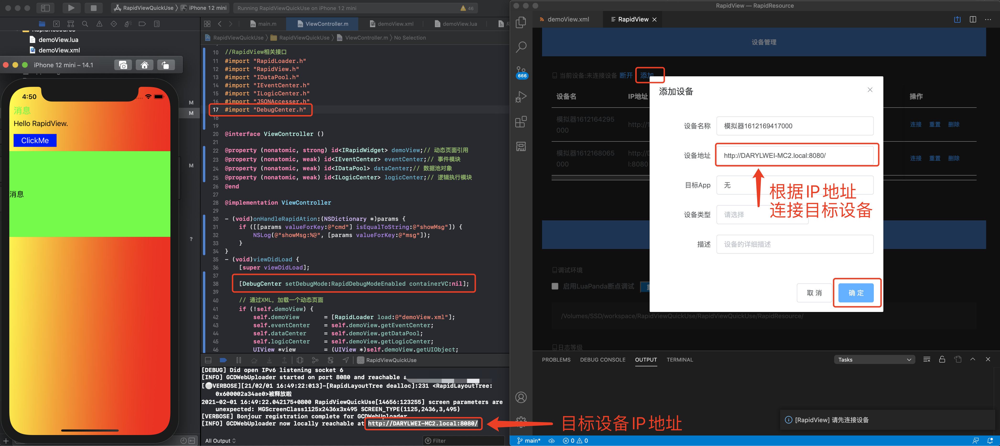
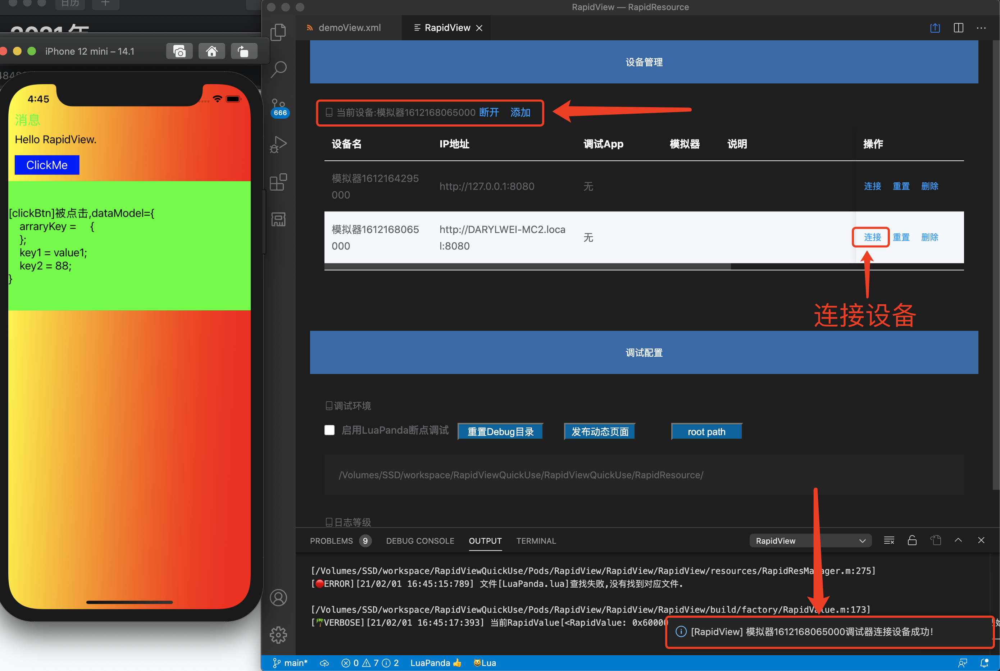
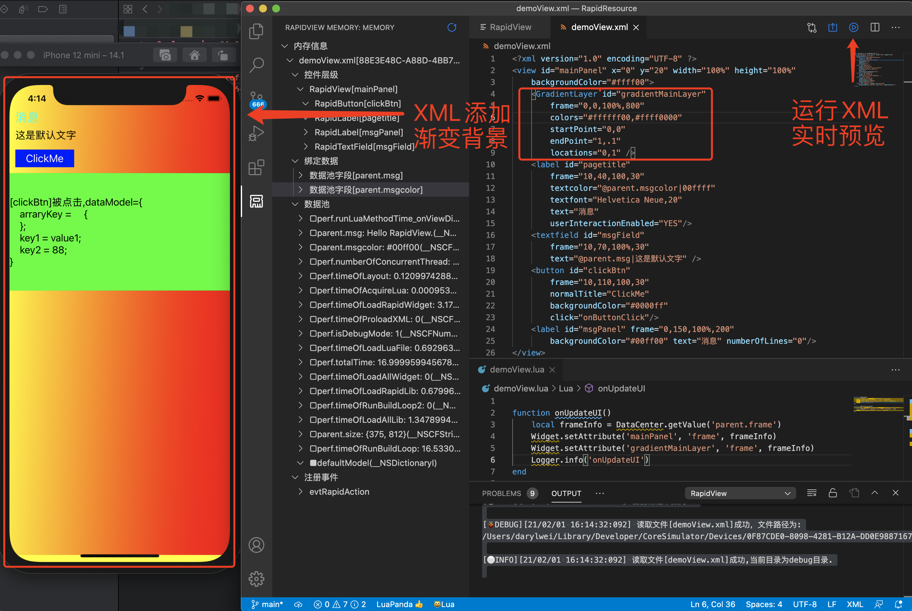
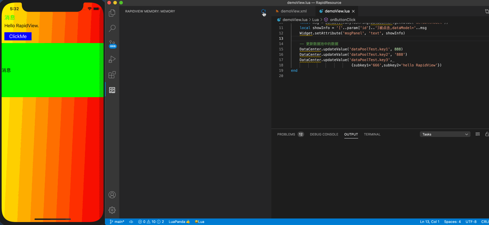

## RapidView插件功能介绍
**注:RapidView插件推荐跟LuaPanda插件同时使用，进行RapidView项目的开发，支持断点调试。如图:**


#### 1.设备连接、设备管理
第一步，native代码中开启调试模式，代码如下:

``` 
#import "DebugCenter.h"
[DebugCenter setDebugMode:RapidDebugModeEnabled containerVC: nil ];
```
第二步，运行目标App，获取设备IP，插件中添加目标设备，如图:

第三步，设备添加成功后，直接连接设备，如图:


#### 2.UI布局预览
设备连接成功后，直接运行布局文件，设备上UI实时预览。


#### 3.文件上传
设备连接成功后，点击上传按钮，重新加载页面，上传文件实时生效。

#### 4.内存调试
设备连接成功后，点击内存Tab中的刷新按钮，获取实时的内存信息，包括：1.控件层级查看；2.数据Model、数据绑定查看；3.注册事件查看。具体操作如下:


#### 5.实时日志
设备连接成功后，日志实时输出到vscode，并且可以设置日志等，共有5个级别：Error、Warn、Info、Debug、Verbose。具体操作如下:


## Author

darylwei,darylwei@tencent.com

## License

RapidView is available under the MIT license. See the LICENSE file for more info.
